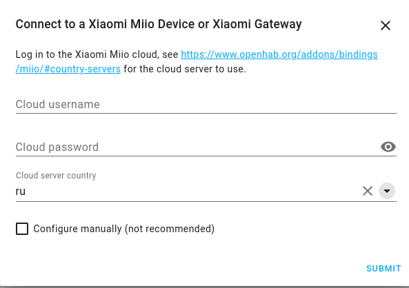

Instruction on how to connect your smart home device (temperature sensor) to Home Assistant and send data to Robonomics. There will be two methods to connect your device: directly to Raspberry Pi via zigbee2MQTT adapter or through Xiaomi Gateway.
# Requirements

* Raspberry Pi 4 or 3
* SD card and SD adapter
* Temperature sensor - [Keen Home RS-THP-MP-1.0](https://www.zigbee2mqtt.io/devices/RS-THP-MP-1.0.html) (or another [supported device](https://www.zigbee2mqtt.io/information/supported_devices.html))

### Method 1 (with zigbee2MQTT)
* Zigbee adapter [JetHome USB JetStick Z2](https://jhome.ru/catalog/parts/PCBA/293/) (or one of [supported](https://www.zigbee2mqtt.io/information/supported_adapters.html))

### Method 2 (with Xiaomi Gateway)
* Xiaomi Gateway (one of [supported](https://www.home-assistant.io/integrations/xiaomi_miio#xiaomi-gateway))
* [Mi Home app](https://play.google.com/store/apps/details?id=com.xiaomi.smarthome&hl=ru&gl=US)

# Raspberry setup

You need to setup Raspberry Pi for both methods.

Install [Raspberry Pi Imager](https://www.raspberrypi.com/software/) on your computer. Insert SD card and run Imager. Choose 64-bit Ubuntu Server as an OS and your SD card and press `write`.


Open SD card and navigate inside the root folder of the card. The name should be something like `system-boot`.

Find the file named `network-config` and open it in a text editor. Write this to the file:
```
version: 2
ethernets:
  eth0:
    dhcp4: true
    optional: true
wifis:
  wlan0:
    dhcp4: true
    optional: true
    access-points:
      "YOUR_WIFI_NAME":
        password: "YOUR_WIFI_PASSWORD"
```

Save file, insert SD card to the Raspberry and turn it on. It must connect to your wi-fi network, now you need to find its address. Firstly find your address in the local network with:
```bash
ip a
```
It must look like `192.168.xx.xx` or `172.xx.xx.xx`.

Then scan the network with your address and zero in the end:

```bash 
$ sudo nmap -sP 192.168.xx.0/24
Starting Nmap 7.80 ( https://nmap.org ) at 2020-06-26 13:50 CEST
Nmap scan report for _gateway (192.168.43.1)
Host is up (0.015s latency).
MAC Address: 8E:F5:A3:DB:03:27 (Unknown)
Nmap scan report for ubuntu (192.168.43.56)
Host is up (0.049s latency).
MAC Address: DC:A6:32:02:46:50 (Raspberry Pi Trading)
Nmap scan report for LAPTOP-27UBLNO7 (192.168.43.234)
Host is up (0.00057s latency).
MAC Address: 7C:B2:7D:9E:95:DA (Intel Corporate)
Nmap scan report for ed-vm (192.168.43.138)
Host is up.
Nmap done: 256 IP addresses (4 hosts up) scanned in 2.07 seconds
```
There raspberry's address is `192.168.43.56`. Now you can connect to it over ssh:
```bash
ssh ubuntu@192.168.43.56
```
Password is "ubuntu".

## Substrate Interface

To pub data to Robonomics you need to install `substrate-interface` python package (you need to install RUST before):

```bash
curl --proto '=https' --tlsv1.2 -sSf https://sh.rustup.rs | sh
source $HOME/.cargo/env
rustup default nightly
pip3 install substrate-interface
```

## Home Assistant

Now we need to install Home Assistant to Raspberry. Installation instructions are [here](https://www.home-assistant.io/installation/linux#install-home-assistant-core). You need to install `Home Assistant Core`.

After installation create `send_datalog.py` script that will send receiving data to Robonomics:

```bash
sudo nano /srv/homeassistant/python_scripts/send_datalog.py
```

And add the folloving (replace `<mnemonic>` with mnemonic seed from your account in Robonomics Network):
```python
from substrateinterface import SubstrateInterface, Keypair
import time
import sys
from Crypto.PublicKey import RSA
from Crypto.Cipher import PKCS1_OAEP
import binascii
import nacl.secret
import base64

mnemonic = <mnemonic>
substrate = SubstrateInterface(
                    url="wss://main.frontier.rpc.robonomics.network",
                    ss58_format=32,
                    type_registry_preset="substrate-node-template",
                    type_registry={
                        "types": {
                            "Record": "Vec<u8>",
                            "<T as frame_system::Config>::AccountId": "AccountId",
                            "RingBufferItem": {
                                "type": "struct",
                                "type_mapping": [
                                    ["timestamp", "Compact<u64>"],
                                    ["payload", "Vec<u8>"],
                                ],
                            },
                        }
                    }
                )

keypair = Keypair.create_from_mnemonic(mnemonic, ss58_format=32)
seed = keypair.seed_hex
b = bytes(seed[0:32], "utf8")
box = nacl.secret.SecretBox(b)
data = ' '.join(sys.argv[1:])
data = bytes(data, 'utf-8')

encrypted = box.encrypt(data)
text = base64.b64encode(encrypted).decode("ascii")
print(f"Got message: {data}")
call = substrate.compose_call(
        call_module="Datalog",
        call_function="record",
        call_params={
            'record': text
        }
    )
extrinsic = substrate.create_signed_extrinsic(call=call, keypair=keypair)
receipt = substrate.submit_extrinsic(extrinsic, wait_for_inclusion=True)
print(f"Datalog created with extrinsic hash: {receipt.extrinsic_hash}")
```

# Sensors Connection Method 1 (with zigbee2MQTT)

## Mosquitto MQTT broker

Now you neet to install MQTT broker to Raspberry:

```bash
sudo apt update
sudo apt install mosquitto mosquitto-clients
```
Mosquitto will run automatically after installation.

## Zigbee2MQTT setup

If you have JetHome USB JetStick Z2 it already has necessary firmware so you don't need to flash it. But if you have another adapter firstly you need to flash it with zigbee2MQTT software. You can find instructions for you device [here](https://www.zigbee2mqtt.io/information/supported_adapters.html).

Then we need to install ziqbee2mqtt software on Raspberry. Connect the adapter and verify the adapter address (it also may be `/dev/ttyUSB1`):
```bash
$ ls -l /dev/ttyUSB0
crw-rw---- 1 root dialout 166, 0 May 16 19:15 /dev/ttyUSB0 
```
Install zigbee2MQTT:
```bash
# Setup Node.js repository
sudo curl -sL https://deb.nodesource.com/setup_14.x | sudo -E bash -

# NOTE 1: If you see the message below please follow: https://gist.github.com/Koenkk/11fe6d4845f5275a2a8791d04ea223cb.
# ## You appear to be running on ARMv6 hardware. Unfortunately this is not currently supported by the NodeSource Linux distributions. Please use the 'linux-armv6l' binary tarballs available directly from nodejs.org for Node.js 4 and later.
# IMPORTANT: In this case instead of the apt-get install mentioned below; do: sudo apt-get install -y git make g++ gcc

# NOTE 2: On x86, Node.js 10 may not work. It's recommended to install an unofficial Node.js 14 build which can be found here: https://unofficial-builds.nodejs.org/download/release/ (e.g. v14.16.0)

# Install Node.js;
sudo apt-get install -y nodejs git make g++ gcc

# Verify that the correct nodejs and npm (automatically installed with nodejs)
# version has been installed
node --version  # Should output v10.X, v12.X, v14.X or v15.X
npm --version  # Should output 6.X or 7.X

# Clone Zigbee2MQTT repository
sudo git clone https://github.com/Koenkk/zigbee2mqtt.git /opt/zigbee2mqtt
sudo chown -R ubuntu:ubuntu /opt/zigbee2mqtt

# Install dependencies (as user "ubuntu")
cd /opt/zigbee2mqtt
npm ci
```
Then you need to configure it. Open configuration file:
```bash
nano /opt/zigbee2mqtt/data/configuration.yaml
```
And paste this:
```
permit_join: true
mqtt:
  # MQTT base topic for Zigbee2MQTT MQTT messages
  base_topic: zigbee2mqtt
  # MQTT server URL
  server: 'mqtt://localhost'
```
Now you can run zigbee2mqtt:
```bash
cd /opt/zigbee2mqtt
npm start
```
## Pairing device

Then you need to pair your sensor. For that just long press the pover button untill it start to blink (zigbee2MQTT must be launched). After sensor connects you will see the message like:
```
Zigbee2MQTT:info  2019-11-09T12:19:56: Successfully interviewed '0x00158d0001dc126a', device has successfully been paired
```
> Remember this number `0x00158d0001dc126a` it will be the topic name for your sensor's data.
Then open configuration file again and set `permit_join: false`.

Then lets make a service. Create the file:
```bash
sudo nano /etc/systemd/system/zigbee2mqtt.service
```
Add the following to this file:
```
[Unit]
Description=zigbee2mqtt
After=network.target

[Service]
ExecStart=/usr/bin/npm start
WorkingDirectory=/opt/zigbee2mqtt
StandardOutput=inherit
# Or use StandardOutput=null if you don't want Zigbee2MQTT messages filling syslog, for more options see systemd.exec(5)
StandardError=inherit
Restart=always
User=pi

[Install]
WantedBy=multi-user.target
```

Verify that the configuration works:

```bash
sudo systemctl start zigbee2mqtt
```

```bash
systemctl status zigbee2mqtt.service
```

Output should look like:
```
pi@raspberry:/opt/zigbee2mqtt $ systemctl status zigbee2mqtt.service
● zigbee2mqtt.service - zigbee2mqtt
   Loaded: loaded (/etc/systemd/system/zigbee2mqtt.service; disabled; vendor preset: enabled)
   Active: active (running) since Thu 2018-06-07 20:27:22 BST; 3s ago
 Main PID: 665 (npm)
   CGroup: /system.slice/zigbee2mqtt.service
           ├─665 npm
           ├─678 sh -c node index.js
           └─679 node index.js

Jun 07 20:27:22 raspberry systemd[1]: Started zigbee2mqtt.
Jun 07 20:27:23 raspberry npm[665]: > zigbee2mqtt@1.6.0 start /opt/zigbee2mqtt
Jun 07 20:27:23 raspberry npm[665]: > node index.js
Jun 07 20:27:24 raspberry npm[665]: Zigbee2MQTT:info  2019-11-09T13:04:01: Logging to directory: '/opt/zigbee2mqtt/data/log/2019-11-09.14-04-01'
Jun 07 20:27:25 raspberry npm[665]: Zigbee2MQTT:info  2019-11-09T13:04:01: Starting Zigbee2MQTT version 1.6.0 (commit #720e393)
```

Now that everything works, we want systemctl to start Zigbee2MQTT automatically on boot, this can be done by executing:

```bash
sudo systemctl enable zigbee2mqtt.service
```

## Home Assistant Setup

Open Home Assistant configuration file:

```bash
nano ~/.homeassistant/configuration.yaml
```

And add the following to setup MQTT broker and sensor (replace `topic_name` with the topic name from previous step):

```
# MQTT broker setup
mqtt:
  broker: localhost
  port: 1883

# Sensor setup
sensor:
  - platform: mqtt
    state_topic: "zigbee2mqtt/<topic_name>"
    name: "MQTT Climate Humidity"
    unit_of_measurement: '%'
    value_template: "{{ value_json.humidity }}"
  - platform: mqtt
    state_topic: "zigbee2mqtt/<topic_name>"
    name: "MQTT Climate Temperature"
    unit_of_measurement: ''
    value_template: "{{ value_json.temperature }}"
  - platform: mqtt
    state_topic: "zigbee2mqtt/<topic_name>"
    name: "MQTT Climate Pressure"
    unit_of_measurement: ''
    value_template: "{{ value_json.pressure }}"
  - platform: mqtt
    state_topic: "zigbee2mqtt/<topic_name>"
    name: "MQTT Climate Battery"
    unit_of_measurement: ''
    value_template: "{{ value_json.battery }}"
  - platform: mqtt
    state_topic: "zigbee2mqtt/<topic_name>"
    name: "MQTT Climate Link Quality"
    unit_of_measurement: ''
    value_template: "{{ value_json.linkquality }}"
  - platform: mqtt
    state_topic: "zigbee2mqtt/<topic_name>"
    name: "MQTT Climate Voltage"
    unit_of_measurement: ''
    value_template: "{{ value_json.voltage }}"

# Trigger on receiving data
automation:
  - alias: "send_datalog_climate"
    trigger:
      platform: mqtt
      topic: "zigbee2mqtt/0x00158d0006bcd022"
    action:
      service: shell_command.send_datalog_climate

# Shell command that will run on the trigger
shell_command:
  send_datalog_climate: 'python3 python_scripts/send_datalog.py temperature={{ states("sensor.mqtt_climate_temperature")  }} humidity={{ states("sensor.mqtt_climate_humidity") }} pressure={{ states("sensor.mqtt_pressure") }} battery={{ states("sensor.mqtt_climate_battery") }} linkquality={{ states("sensor.mqtt_climate_link_quality") }} voltage={{ states("sensor.mqtt_climate_voltage") }}'
```

Then start Home Assistant with new configuration:

```bash
cd /srv/homeassistant
hass
```

To see the sensor data in Home Assistant you need to add it. For that open the browser on your computer and go to:
```
http://<raspberry_address>:8123
```
Press on three dots on the right side and choose `Edit Dashboard`


Then press `Add Card`


Go to `By Entity` and tick all sensors that you need


Pres continue and you will be able to see sensor data at the homepage (you may see `unknown` before sensor send new data)

In a similar way you can add card for Robonomics Service. With this you can start or stop the servise or send current measurements with `run action` button.


You homepage will look like this


# Sensors Connection Method 2 (with Xiaomi Gateway)

You need your gateway with all sensors to be connected to the Mi Home app. If you haven't done this yet press `+` button on the top right corner, find your hub (it must be in connecting mode with long press to power button) and follow instructions in the app. After you add the gateway, you need to add sensors: press on your gateway, then go to `Child device` and press `+`. Find required device and follow the instructions on the screen. For more details look at user manual of your hub.

## Add Gateway to Home Assistant

Start Home Assistant if you haven't done it yet:
```bash
cd /srv/homeassistant
hass
```

In your Home Assistant:
```
http://<raspberry_address>:8123
```
Go to `Configuration/Integrations` and press `Add Intagration`. There you need to Find `Xiaomi Miio`:


Then fill your username (or phone) and password from Mi Home account and choose your country server:



Press `Submit` and choose your Hub (Aqara Hub in this example):


Press `Submit` and you will be able to see your gateway in Integrations page.

Then we need to setup action to send data to Robonomics. For that open a configuration file:

```bash
nano ~/.homeassistant/configuration.yaml
```

And add following to the end of file:

```
automation:
  - alias: "send_datalog_temperature_sensor"
    trigger:
      platform: time_pattern
      minutes: "/5"
    action:
      service: shell_command.send_datalog_temperature_sensor

  - alias: "send_datalog_contact_sensor"
    trigger:
      platform: state
      entity_id:
        - binary_sensor.contact_sensor
    action:
      service: shell_command.send_datalog_contact_sensor

shell_command:
  send_datalog_temperature_sensor: 'python3 python_scripts/send_datalog.py sensor_humidity={{ states("sensor.temperature_sensor_humidity") }} sensor_temp={{ states("sensor.temperature_sensor_temperature") }} sensor_battery={{ states("sensor.temperature_sensor_battery") }}'
  send_datalog_contact_sensor: 'python3 python_scripts/send_datalog.py sensor_contact={{ states("binary_sensor.contact_sensor") }}'
```

You can choose how often you want to send data with changing the value in `minutes: "/5"`.

Restart Home Assistant. You can add the data from sensors to your homepage like in `Home Assistant setup` in the description to Method 1.
